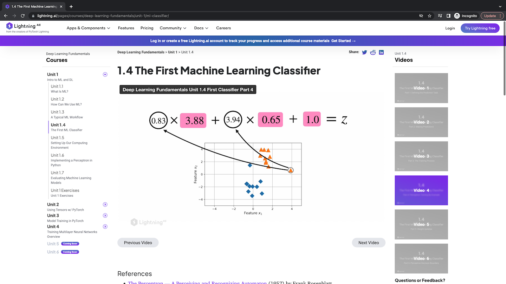
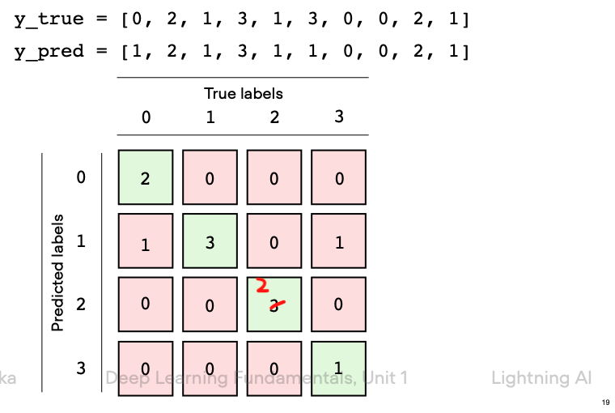

# Errata

## Unit 1.4

**Video 3**

The minus sign is flipped in unit 1.4 video 3. It should be -1.14 instead of 1.14. [[See discussion](https://github.com/Lightning-AI/dl-fundamentals/discussions/10#discussion-4672374)]

**Video 4**

Flip x1, x2 3:19 onwards, see [#22](https://github.com/Lightning-AI/dl-fundamentals/discussions/22)

## Unit 1.7

The confusion matrix shows [2, 2] = 3 but it should be [2, 2] = 2.

## Unit 3.3

It should be 

$$w + \Delta w$$

where 

$$\Delta w = - \alpha \nabla L_w$$

(the minus sign was missing on one slide)
