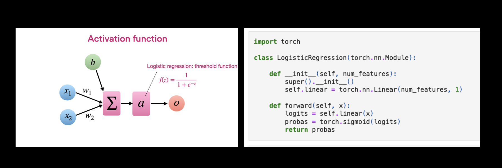

# Deep Learning Fundamentals Unit 3

## Model Training in PyTorch

Unit 3 introduces the concept of single-layer neural networks and a simple classification model: logistic regression. While *Deep Learning Fundamentals* is about deep learning, logistic regression is an excellent model for studying all the fundamental concepts we will use to implement deep neural networks in the upcoming units.

This Studio provides a reproducible environment with the supplementary code for Unit 3 of the [**Deep Learning Fundamentals**](https://lightning.ai/pages/courses/deep-learning-fundamentals/) class by Sebastian Raschka, which is freely available at Lightning AI.

 

**What's included?**

Click the "Run Template" button at the top of this page to launch into a Studio environment that contains the following materials:

- `3.6-logreg-in-pytorch`: The code materials used in *3.6 Training a Logistic Regression Model in PyTorch – Parts 1-3*

- `exercises/`: 
  - `1_banknotes`: Exercise 1,  applying logistic regression to a banknote authentication dataset
  - `2_standardization`: Exercise 2, extending exercise 1 by adding code to standardize the features for better training performance
- `solutions/`: Solutions to the exercises above

---

 

<iframe width="560" height="315" src="https://www.youtube.com/embed/5XL-FdlsRqg?si=5Hmhj_u3Ud9zeKPK" title="YouTube video player" frameborder="0" allow="accelerometer; autoplay; clipboard-write; encrypted-media; gyroscope; picture-in-picture; web-share" allowfullscreen></iframe>

- Videos of [Part 2](https://www.youtube.com/watch?v=MMcOAT3KNgo&list=PLaMu-SDt_RB6dG-0C78fmIkMeXL6mzpmm&index=14) and [Part 3](https://www.youtube.com/watch?v=tyHhsY5mVt4&list=PLaMu-SDt_RB6dG-0C78fmIkMeXL6mzpmm&index=15)
- [The complete YouTube Playlist](https://www.youtube.com/playlist?list=PLaMu-SDt_RB6dG-0C78fmIkMeXL6mzpmm) with all 17 videos in Unit 3
- [Or access the Unit 3 videos on the Lightning website](https://lightning.ai/courses/deep-learning-fundamentals/3-0-overview-model-training-in-pytorch/), which includes additional quizzes

 

## About Unit 3: Model Training in PyTorch

Logistic regression, similar to the perceptron, is a model for binary classification. In fact, many of its concepts, such as the sigmoid activation and the logistic loss, are also used in deep neural networks. So, it’s an important model that we will look at closely in Unit 3.

In this Studio, you'll learn how to implement a logistic regression model using the `torch.nn.Module` class. Then, you'll train this logistic regression model by implementing a training loop based on PyTorch’s automatic differentiation capabilities.

After completing Unit 3, we covered all the essential tools for implementing deep neural networks in the next unit: activation functions, loss functions, and essential deep learning utilities of the PyTorch API.

Learn more by watching the videos of Deep Learning Fundamentals linked above and follow along with the code and exercises in this Studio. You can launch it by clicking the "Run Template" button at the top of this page to get started.

