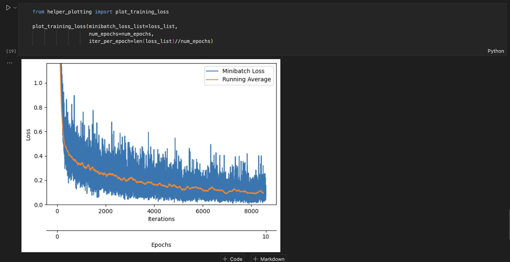
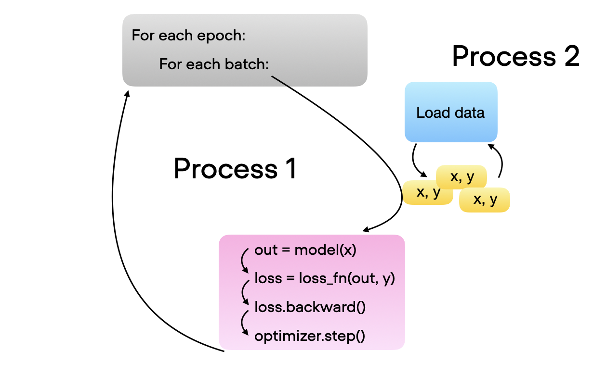
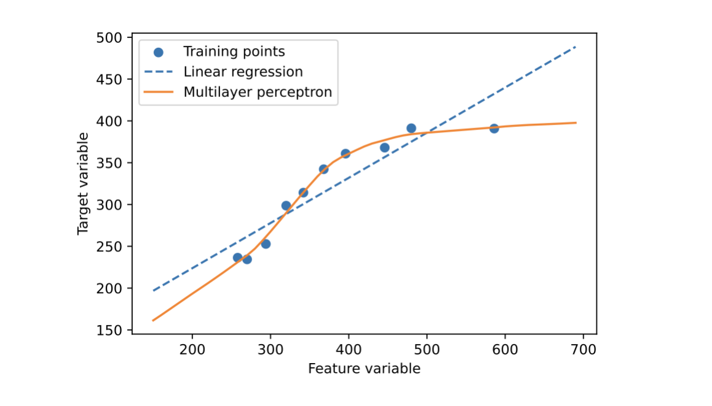

# Deep Learning Fundamentals Unit 4

## Training Multilayer Neural Networks

Unit 4 covers training multilayer perceptrons in PyTorch with datasets like MNIST, optimizing data loading using PyTorch's Dataset and DataLoader classes for efficiency, and adapting neural networks for regression tasks by modifying the output layer and loss function.

This Studio provides a reproducible environment with the supplementary code for Unit 4 of the [**Deep Learning Fundamentals**](https://lightning.ai/pages/courses/deep-learning-fundamentals/) class by Sebastian Raschka, which is freely available at Lightning AI.

 

**What's included?**

Click the "Run Template" button at the top of this page to launch into a Studio environment that contains the following materials:

- `code-units/`:

  - `4.3-mlp-pytorch`: The code materials used in *Training a Multilayer Perceptron in PyTorch – Parts 1-5*

  - `4.4-dataloaders`: The code materials used in *Defining Efficient Data Loaders – Parts 1-4*

  - `4.5-mlp-regression`: The code materials used in *Multilayer Neural Networks for Regression – Parts 1 & 2* 

- `exercises/`: 
  - `ex1_changing-layers`: Exercise 1,  changing a multilayer percepron architecture to achieve the same (or better) performance with fewer parameters
  - `ex2_fashion-mnist`: Exercise 2, implementing a custom Dataset class for Fashion MNIST
- `solutions/`: Solutions to the exercises above

---

 

<iframe width="560" height="315" src="https://www.youtube.com/embed/XNi5TPSxmZA?si=6Mv0h-svvRk3rfzg" title="YouTube video player" frameborder="0" allow="accelerometer; autoplay; clipboard-write; encrypted-media; gyroscope; picture-in-picture; web-share" allowfullscreen></iframe>

- Videos of [Part 2](https://www.youtube.com/watch?v=3LzPXjobVdM&list=PLaMu-SDt_RB6KyP_bNaTghy4_Py2X4hq_&index=11), [Part 3](https://www.youtube.com/watch?v=1LGkjcAtt8E&list=PLaMu-SDt_RB6KyP_bNaTghy4_Py2X4hq_&index=12), [Part 4](https://www.youtube.com/watch?v=OzQ6jo54rtM&list=PLaMu-SDt_RB6KyP_bNaTghy4_Py2X4hq_&index=13), and [Part 5](https://www.youtube.com/watch?v=jrPTiNgHj5s&list=PLaMu-SDt_RB6KyP_bNaTghy4_Py2X4hq_&index=14)
- [The complete YouTube Playlist](https://www.youtube.com/watch?v=vrAQPyHKFas&list=PLaMu-SDt_RB6KyP_bNaTghy4_Py2X4hq_) with all 21 videos in Unit 4
- [Or access the Unit 4 videos on the Lightning website](https://lightning.ai/courses/deep-learning-fundamentals/), which includes additional quizzes

 

## About Unit 4: Training Multilayer Neural Networks

We begin with Unit 4.3, training a multilayer perceptron model using PyTorch, starting with the XOR dataset as a warm-up before advancing to the more complex MNIST handwritten digit classification dataset. This part focuses on reshaping the 28×28 images into vectors for the model and achieving high prediction accuracy, demonstrating the basic application of multilayer perceptrons for classification tasks.

As the complexity of neural networks and datasets increases, optimizing the data-loading pipeline becomes crucial. We address this in Unit 4.4 by discussing PyTorch's Dataset and DataLoader classes, which are designed to efficiently fetch training batches in the background using multiple processes. This ensures computational efficiency by preparing the next batch of data while the model is completing its current processing, thereby preventing bottlenecks.

Moving beyond classification, Unit 4.5 explores how deep neural networks, specifically multilayer perceptrons, can be adapted for regression tasks. This is achieved with two key adjustments: removing the logistic sigmoid or softmax activation function from the output layer, and replacing the cross entropy loss with the mean squared error loss. This part highlights the versatility of neural networks in handling various types of predictive modeling tasks beyond the commonly used classification frameworks.

Learn more by watching the videos of Deep Learning Fundamentals linked above and follow along with the code and exercises in this Studio. You can launch it by clicking the "Run Template" button at the top of this page to get started.
