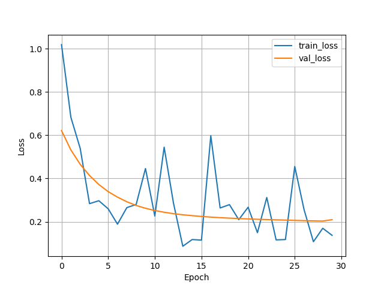
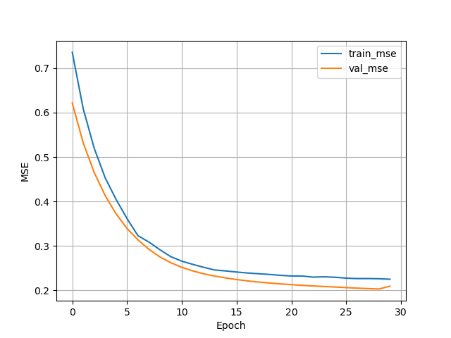

# Exercise 1 - Changing the Classifier to a Regression Model


Remember the regression model we trained in Unit 4.5? To get some hands-on practice with PyTorch and the `LightningModule` class, we are going to convert the MNIST classifier we used in this unit (Unit 5) and convert it to a regression model. 

For this, we are going to use the [Ames Housing Dataset](https://www.openml.org/search?type=data&sort=runs&id=41211) from OpenML. But no worries, you don't have to code the `Dataset` and `DataModule` classes yourself! I already took care of that and provide you with a working `AmesHousingDataModule`. However your task is to change the `PyTorchMLP` into a regression model, and you have to make adjustments to the `LightningModel` to track the mean squared error instead of the classification accuracy.

If you are successful, the mean squared errors for the training, validation, and test set should be around 0.2 to 0.3. 





**Here is a link to the start code: [https://github.com/Lightning-AI/dl-fundamentals/tree/main/unit05-lightning/exercises/1_lightning-regression](https://github.com/Lightning-AI/dl-fundamentals/tree/main/unit05-lightning/exercises/1_lightning-regression)**

And below are some tips and comments about changes you need to make. 

As always, please don't hesitate to reach out for help via the forums if you get stuck!

## In `training.py`

- Use`TensorBoard` or import the `CSVLogger`  and use it in the Trainer (see Unit 6)
- Replace the `MNISTDataModule()` with the `AmesHousingDataModule()`(already provided in the `shared_utilities.py` file)
- Change the number of features in the `PyTorchMLP(...)` class to 3, remove the classes
- Change "acc" to "mse"
- Add the logging code at the bottom if you use the CSV logger. In that case, it would be: 

```python
metrics = pd.read_csv(f"{trainer.logger.log_dir}/metrics.csv")

aggreg_metrics = []
agg_col = "epoch"
for i, dfg in metrics.groupby(agg_col):
    agg = dict(dfg.mean())
    agg[agg_col] = i
    aggreg_metrics.append(agg)

df_metrics = pd.DataFrame(aggreg_metrics)
df_metrics[["train_loss", "val_loss"]].plot(
    grid=True, legend=True, xlabel="Epoch", ylabel="Loss"
)
df_metrics[["train_mse", "val_mse"]].plot(
    grid=True, legend=True, xlabel="Epoch", ylabel="MSE"
)

plt.show()
```

## In `shared_utilities.py`

Modify the `PyTorchMLP` class as follows:

- Remove the `num_classes` argument from the `PyTorchMLP`
- Change the network to 1 output node & flatten the logits, (e.g,. using the `torch.flatten` function`)
- Optionally only use 1 instead of 2 hidden layers to reduce overfitting

Modify the `LightningModel` class as follows:

- Use `MeanSquaredError` instead of `Accuracy` via torchmetrics
- Change the loss function accordingly
- Make sure you are returning the predictions correctly in `_shared_step`, they are not class labels anymore
- Change `acc` to `mse` everywhere

