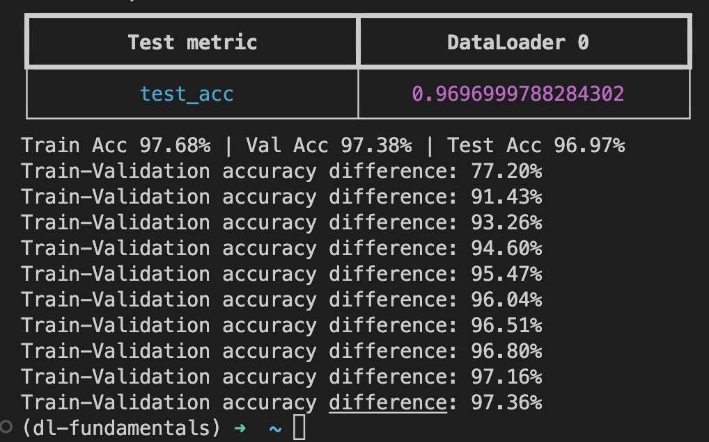
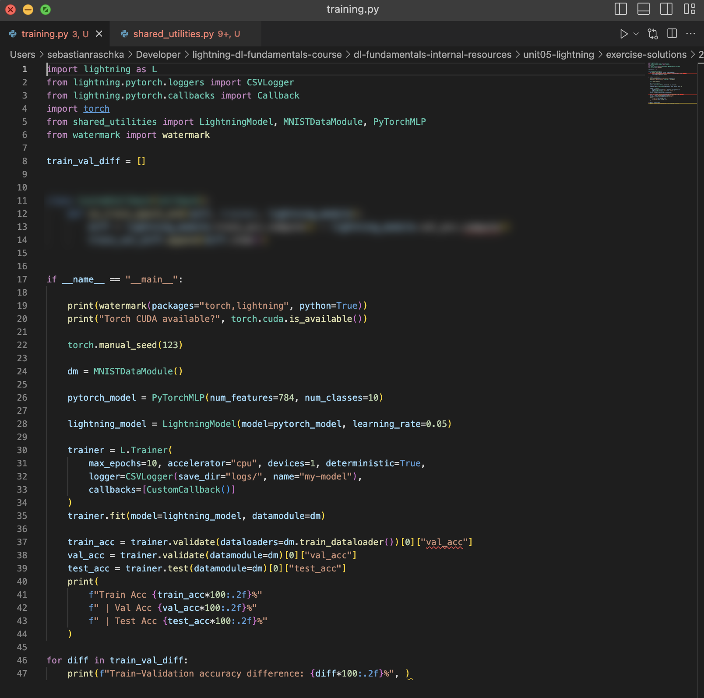

# Exercise 2 - A Custom Plugin for Tracking Training and Validation Accuracy Difference

In this exercise, modify the existing MNIST classifier such that it tracks the difference between the training set and validation set accuracy after each epoch: 

Here, it's easiest to implement the plug in such that it computers the training set accuracy minus the validation accuracy after each epoch ends. This difference is then added to a list that you can print at the end of your script. The solution for this exercise involves only a few lines of code as hinted add in the screenshot of the solution below:

(Note that you could also compute these differences using the logfiles. However, this exercises aims to be an exercise practicing developing custom callbacks.)

**Here is a link to the start code: [https://github.com/Lightning-AI/dl-fundamentals/tree/main/unit05-lightning/exercises/2_custom-callback](https://github.com/Lightning-AI/dl-fundamentals/tree/main/unit05-lightning/exercises/2_custom-callback)**

As always, please don't hesitate to reach out for help via the forums if you get stuck!

