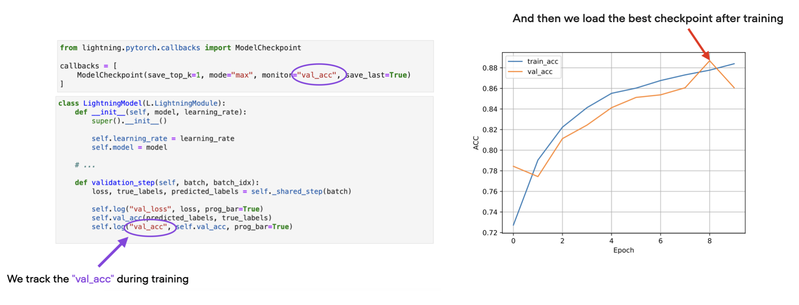
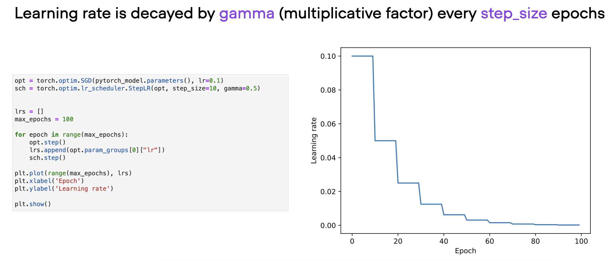

# Deep Learning Fundamentals Unit 6

## Deep Learning Tips and Tricks

In Unit 6, you'll learn about model checkpointing to save the best model during training. You'll also explore learning rate finders and schedulers, and experiment with different optimization algorithms and activation functions.

A crucial issue in deep learning when experimenting with neural network architectures is how to address overfitting. We will cover several techniques to mitigate this. Finally, we will provide practical tips for running hyperparameter sweeps and debugging deep neural networks.

This Studio provides a reproducible environment with the supplementary code for Unit 5 of the [**Deep Learning Fundamentals**](https://lightning.ai/pages/courses/deep-learning-fundamentals/) class by Sebastian Raschka, which is freely available at Lightning AI.

 

**What's included?**

Click the "Run Template" button at the top of this page to launch into a Studio environment that contains the following materials:

- `code-units/`:
  - `6.1-checkpointing`: code for Unit 6.1 on monitoring validation set accuracy during training and creating model checkpoints of the best model during training
  - `6.2-learning-rates`: exploring step schedulers, on-plateau schedulers, and cosine decay schedulers to improve training loss convergence
  - `6.5-hparam-opt`: coding a simple CLI interface for hyperparameter optimization
  - `6.8-debugging`: introducing different debugging strategies to find and address errors during development

- `exercises/`: 
  - `1_cosine-with-warmup`: exercise 1,  experimenting with learning rate warmup during cosine annealing
  - `2_adam-with-weight-decay`: exercise 2, experimenting with weight decay, a regularization technique used in training neural networks to prevent overfitting
- `solutions/`: Solutions to the exercises above

---

 

<iframe width="560" height="315" src="https://www.youtube.com/embed/9Vc7tTWZark?si=qSCYjiALFniK2WGI" title="YouTube video player" frameborder="0" allow="accelerometer; autoplay; clipboard-write; encrypted-media; gyroscope; picture-in-picture; web-share" allowfullscreen></iframe>

- Videos of [Part 2](https://www.youtube.com/watch?v=FmzeUcC7bKc&list=PLaMu-SDt_RB6b4Z_kOUAlT0KI6jTMCKPL&index=3) and [Part 3](https://www.youtube.com/watch?v=FLqHaWgWuiM&list=PLaMu-SDt_RB6b4Z_kOUAlT0KI6jTMCKPL&index=4)
- [The complete YouTube Playlist](https://www.youtube.com/playlist?list=PLaMu-SDt_RB6b4Z_kOUAlT0KI6jTMCKPL) with all 24 videos in Unit 6
- [Or access the Unit 6 videos on the Lightning website](https://lightning.ai/courses/deep-learning-fundamentals/), which includes additional quizzes

 

## About Unit 6: Deep Learning Tips and Tricks

We start this Unit by exploring the concept of early stopping. Previously, we trained a neural network for a given number of epochs and then kept only the last model, assuming the last model corresponds to the “best trained” one. However, if our model starts overfitting, it’s typically not the last model that is the best model. In addition you'll learn how to automatically monitor the validation set accuracy during training and create model checkpoints of the best model during training. The best model checkpoint — the model with the highest validation set accuracy — is then selected for test set evaluation. 

The second topic is learning rate schedulers: step schedulers, on-plateau schedulers, and cosine decay schedulers. They all have in common that they decay the learning rate over time to achieve better annealing — making the loss less jittery or jumpy towards the end of the training. In practice, I often recommend starting without a learning rate scheduler and then adding a learning rate scheduler while making sure that the predictive performance is better than before — if the predictive performance becomes worse than without a scheduler, that’s usually an indicator that the scheduler’s hyperparameters need to be adjusted.

Thirdly, you'll see how to set up a simple command line interface for a Python script that can be used for hyperparameter tuning. And lastly, you'll also learn about some debugging strategies that can be helpful when working with deep neural networks.

