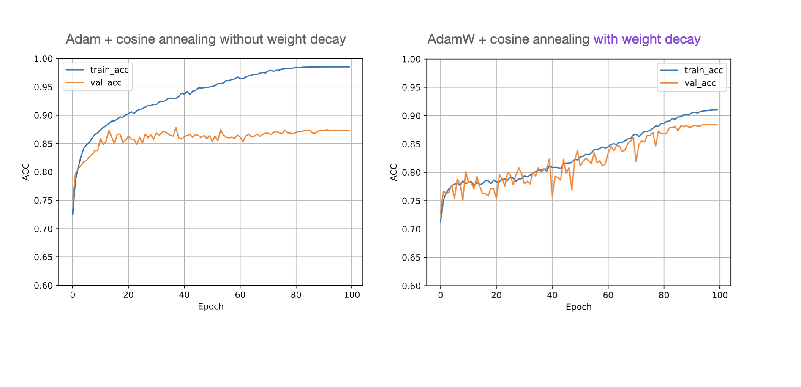

The task of this exercise is to experiment with weight decay. Note that we haven't covered weight decay in the lecture. Related to Dropout (which we covered in Unit 6), weight decay is a regularization technique used in training neural networks to prevent overfitting.

Traditionally, a related method called L2-regularization is used to add a penalty term to the loss function (e.g., the cross entropy loss) that encourages the network to learn smaller weight coefficients. And smaller weights can often lead to less overfitting. That's because smaller weights can help with overfitting. They encourage the model to learn simpler, more generalizable patterns from the training data, rather than fitting the noise or capturing complex, specific patterns that may not generalize well to new, unseen data.

If you want to learn more about L2 regularization, [I covered it in this video here.](https://www.youtube.com/watch?v=uu2X47cSLmM).

Now weight decay is a technique that is directly applied to the weight update rule in the optimizer, skipping the loss modification step. However, it has the same effect as L2-regularization.

For this, we are going to use the so-called AdamW optimizer. AdamW is a variant of the Adam optimization algorithm that decouples weight decay from the adaptive learning rate. In AdamW, weight decay is applied directly to the model's weights instead of incorporating it into the gradients as in the standard Adam. This decoupling is particularly beneficial when using adaptive learning rate methods like Adam, as it allows weight decay to work more effectively as a regularizer.

If you are interested, you can read more about AdamW in the [original research paper here.](https://arxiv.org/abs/1711.05101).

And [here](https://pytorch.org/docs/stable/generated/torch.optim.AdamW.html) is the relevant PyTorch documentation page for the AdamW optimizer.

Your task is now to take the template code and swap the Adam optimizer with AdamW to reduce overfitting. You can mainly ignore the other hyperparameters and focus on changing the `weight_decay` parameter of AdamW. 

Below is an illustration of how Adam compares to AdamW with a tuned weight decay parameter:

(Moreover, the test set performance should increase from 86% to 89%.)