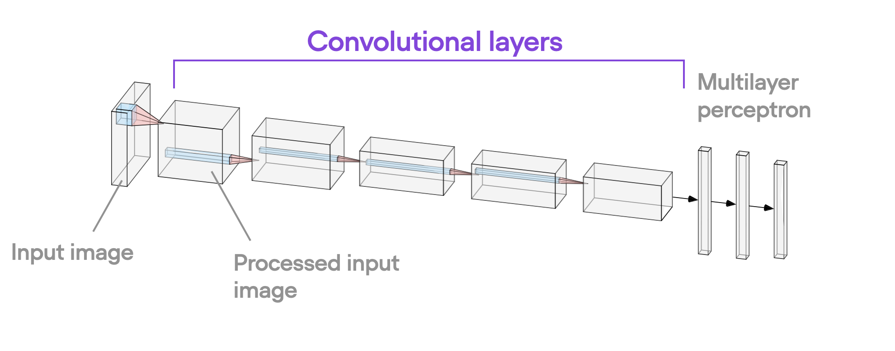
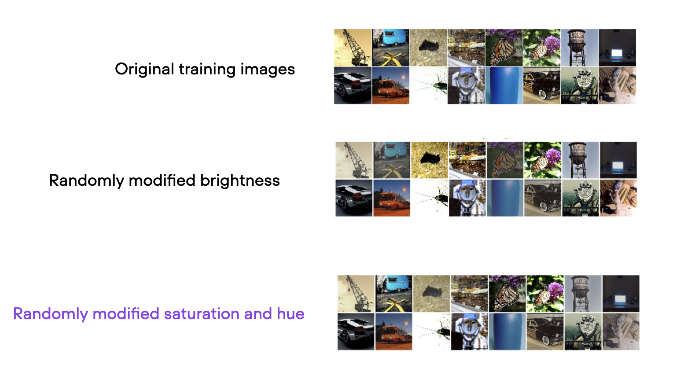
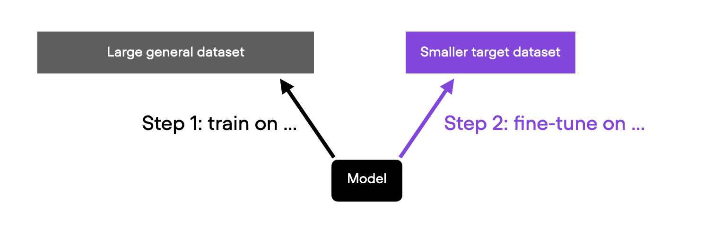
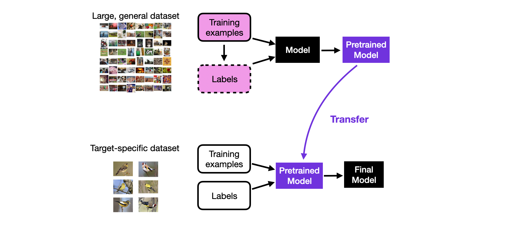

# Deep Learning Fundamentals Unit 7

## Getting Started with Computer Vision

In Unit 7, we will finally get into the exciting topic of computer vision. We will start by discussing the differences between working with tabular and image datasets. Then, we will learn how convolutional neural networks work and implement image classifiers in PyTorch. Lastly, we will discuss how we can utilize pretrained models via transfer learning and how to finetune models pretrained with self-supervised learning.

This Studio provides a reproducible environment with the supplementary code for Unit 7 of the [**Deep Learning Fundamentals**](https://lightning.ai/pages/courses/deep-learning-fundamentals/) class by Sebastian Raschka, which is freely available at Lightning AI.

 

**What's included?**

Click the "Run Template" button at the top of this page to launch into a Studio environment that contains the following materials:

- `code-units/`:
  - `7.4-cnn-training`: code for Unit 7.4 on implementing convolutional neural networks
  - `7.5-data-aug`: implementing different data augmentation techniques to reduce overfitting
  - `7.6-transfer-learning`: exploring pretraining and transfer learning strategies
  - `7.7-self-supervised`: a dive into self-supervised learning to leverage large unlabeled datasets for pretraining

- `exercises/`: 
  - `exercise-1-imagenet`: exercise 1,  training an image classifier on ImageNet
- `solutions/`: Solutions to the exercise above

---

 

<iframe width="560" height="315" src="https://www.youtube.com/embed/VghIoU1uA1Q?si=BS1ak9SKo4VD7TCB" title="YouTube video player" frameborder="0" allow="accelerometer; autoplay; clipboard-write; encrypted-media; gyroscope; picture-in-picture; web-share" allowfullscreen></iframe>

- Videos of [Part 2](https://www.youtube.com/watch?v=vMhfdudHIN0&list=PLaMu-SDt_RB5cm18l0uw3TD2ed2DntcPq&index=13), [Part 3](https://www.youtube.com/watch?v=f2TPkYLsHRk&list=PLaMu-SDt_RB5cm18l0uw3TD2ed2DntcPq&index=14),  [Part 4](https://www.youtube.com/watch?v=f2TPkYLsHRk&list=PLaMu-SDt_RB5cm18l0uw3TD2ed2DntcPq&index=15), and  [Part 5](https://www.youtube.com/watch?v=f2TPkYLsHRk&list=PLaMu-SDt_RB5cm18l0uw3TD2ed2DntcPq&index=16)
- [The complete YouTube Playlist](https://www.youtube.com/watch?v=H8mCQMtFv_0&list=PLaMu-SDt_RB5cm18l0uw3TD2ed2DntcPq) with all 27 videos in Unit 7
- [Or access the Unit 7 videos on the Lightning website](https://lightning.ai/courses/deep-learning-fundamentals/), which includes additional quizzes

 

## About Unit 7: Deep Learning Tips and Tricks

The code in this Studio starts with implementing a convolutional neural network from scratch. Then, you'll learn to implement the popular ResNet model, from scratch, in the form of ResNet-18. And lastly, will see how to load pretrained models from the torchvision hub, which is the recommended way for leveraging existing neural network architectures.

Next, Unit 7.5, you'll explore various different image augmentation techniques. Image augmentation is a convenient approach that allows us to reduce overfitting and increase the generalization performance of our models by generating a larger variety of our existing training examples.

Unit 7.6 shows you how to leverage pretrained models. Since labeled data is typical scarce, In practice, it makes sense to leverate pretrained models that we can further finetune on our target data. This process is called transfer learning, and it’s an extremely popular and successful approach for both image and text data.

Finally, Unit 7.7 covers self-supervised learning, which lets us leverage unlabeled data for pretraining. We also cover the two broad subcategories of self-supervised learning, self-prediction and contrastive learning. Then, to implement a contrastive learning method in practice, we'll look more closely at SimCLR. By the way, the overal concept behind self-supervised learning is also responsible for the success of ChatGPT, but more on large language models in Unit 8!

Learn more by watching the videos of Deep Learning Fundamentals linked above and follow along with the code and exercises in this Studio. You can launch it by clicking the "Run Template" button at the top of this page to get started.
