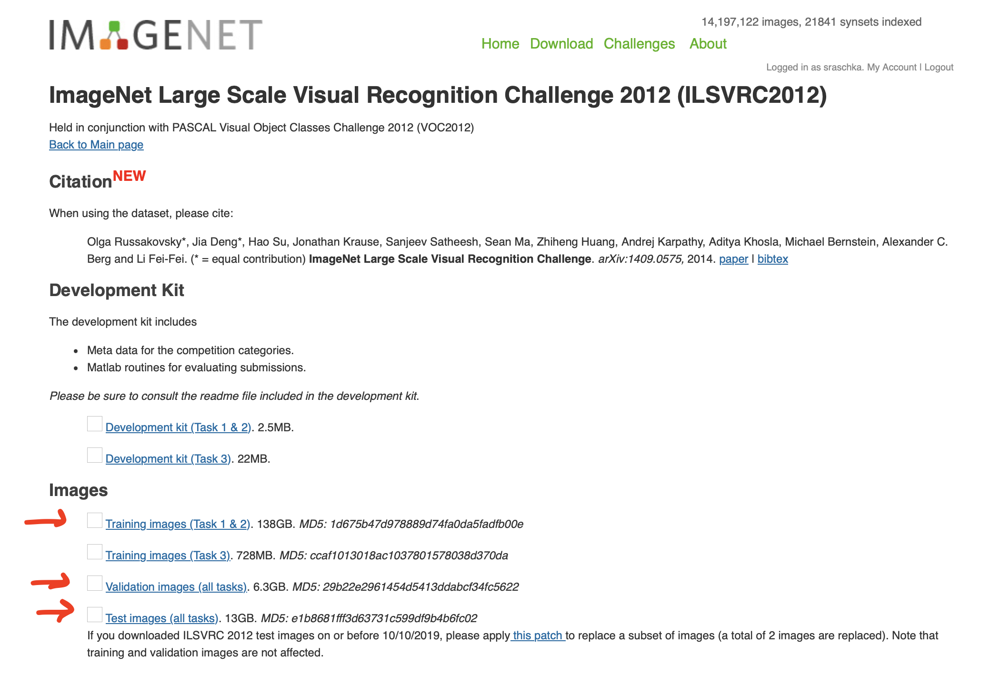
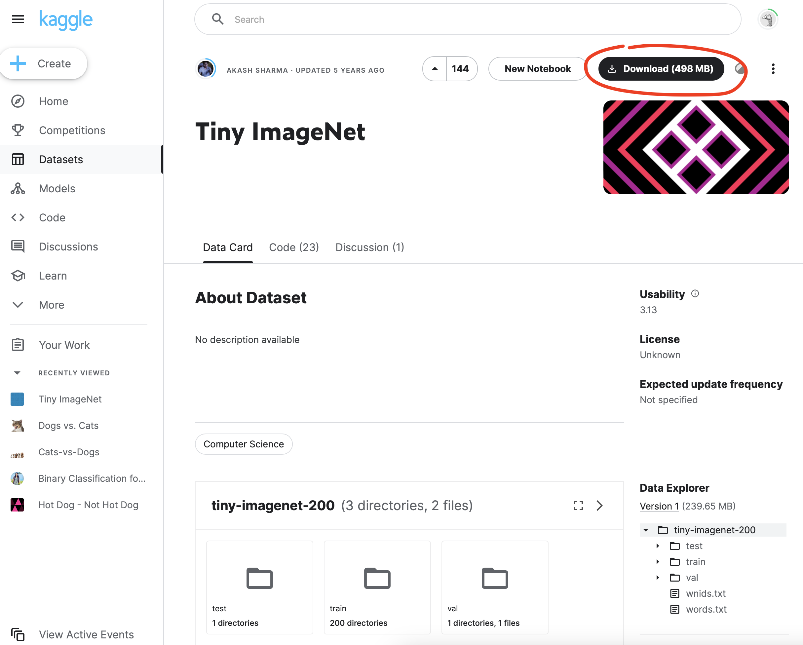

# Exercise 1: ImageNet Classification

In this exercise, we are going to train a classifier on the the ImageNet dataset. In particular, we will be using the Large Scale Visual Recognition Challenge (ILSVRC) 2012 image classification dataset of ImageNet, which is one of the most widely used subsets. 

First, you need to go to the official ImageNet website, [https://image-net.org/](https://image-net.org/) and register for a free account.

Next, you can go to the download page ([https://image-net.org/challenges/LSVRC/2012/2012-downloads.php](https://image-net.org/challenges/LSVRC/2012/2012-downloads.php)) and download the training, validation, and test sets (make sure you have enough disk space available).

- ILSVRC2012_img_train.tar (about 138 GB)
- ILSVRC2012_img_val.tar (about 6.3 GB)
- ILSVRC2012_img_test.tar (about 13 GB)

Next, unzip the files, develop a custom dataset class, and train a ResNet-52 model

## Tiny ImageNet

Since the dataset size above is prohibitive for most people, consider the alternative Tiny ImageNet alternative from [https://www.kaggle.com/competitions/tiny-imagenet/data](https://www.kaggle.com/competitions/tiny-imagenet/data) for the MicroImageNet Challenge

> MicroImageNet classification challenge is similar to the classification challenge in the full ImageNet [ILSVRC](http://www.image-net.org/challenges/LSVRC/2012/index). MicroImageNet contains 200 classes for training. Each class has 500 images. The test set contains 10,000 images. All images are 64x64 colored ones.
>
> Your objective is to classify the 10,000 test set as accurately as possible.

You can download the 500 Mb dataset from here: [https://www.kaggle.com/datasets/akash2sharma/tiny-imagenet](https://www.kaggle.com/datasets/akash2sharma/tiny-imagenet)

