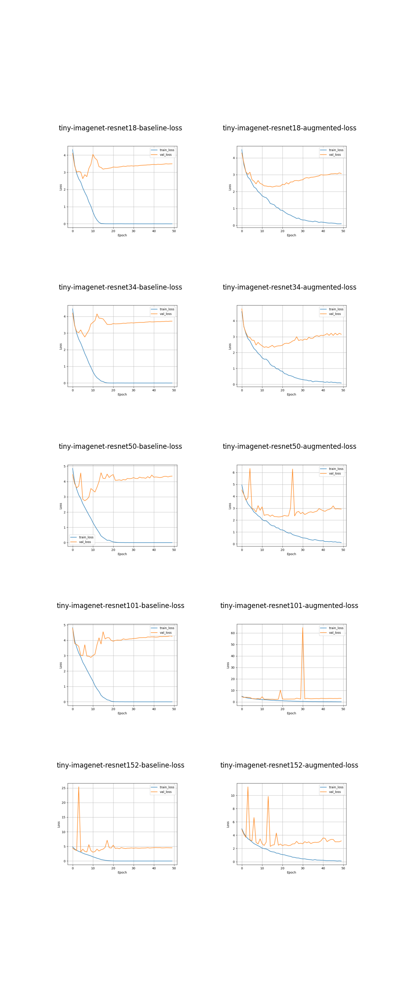

# Solution - Tiny ImageNet

## Code
* `local_utilities.py`: contains the DataModule for Tiny ImageNet and other utility functions. It assumes Tiny ImageNet dataset has been downloaded and put in the './tiny-imagenet-200' directory.
* `training.py`: the main python code that trains the models.
* `tiny-imagenet-resnet.ipynb`: the utility notebook that sanity checks the dataset, plots training/validation loss/accuracy curves, and tests the trained models against test set.

## Models
We trained all variants of vanilla resnet available on torch hub (resnet18, resnet34, resnet50, resnet101, resnet152). For each model variant, a baseline model was trained without data augementation and an enhanced model was trained by applying the image augmentation techniques from section 7.5. On a Google Cloud virtual machine with a single NVIDIA V100 GPU, it took about 60 hours to train all 10 models.

## Result
The best performing model was resnet50 with data augmentaion applied, which achieved 53.5% test accuracy.

### Test accuracy
| Baseline Model Name | Test Accuracy | Augmented Model Name | Test Accuracy |
| ------ | ----- | ----- | ----- |
| tiny-imagenet-resnet18-baseline | 0.4458000063896179 | tiny-imagenet-resnet18-augmented | 0.5205000042915344 |
| tiny-imagenet-resnet34-baseline | 0.4474000036716461 | tiny-imagenet-resnet34-augmented | 0.5231000185012817 |
| tiny-imagenet-resnet50-baseline | 0.4223000109195709 | tiny-imagenet-resnet50-augmented | **0.5349000096321106** |
| tiny-imagenet-resnet101-baseline | 0.43290001153945923 | tiny-imagenet-resnet101-augmented | 0.5210999846458435 |
| tiny-imagenet-resnet152-baseline | 0.4162999987602234 | tiny-imagenet-resnet152-augmented | 0.524399995803833 |

### Training/validation accuracy

### Training/validation loss
