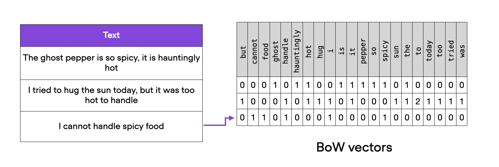
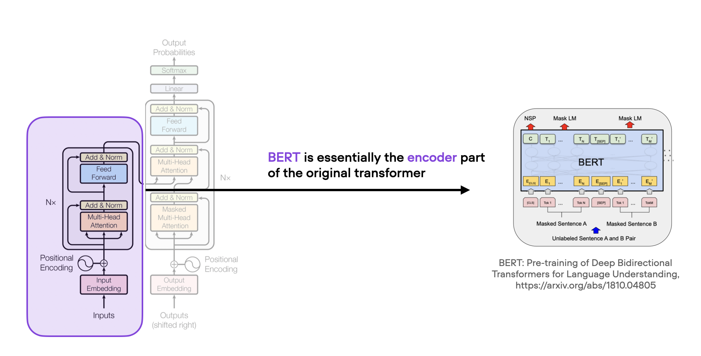

# Deep Learning Fundamentals Unit 8

## Natural Language Processing and Large Language Models

In this unit, we are jumping into natural language processing and large language models, one of the hottest topics in AI. In this unit, you will learn how to work with text data and encode it for machine learning models. You will also learn about deep neural networks for sequence data and large language transformers. After this unit, you will have a solid grasp of attention mechanisms used in large language models and be able to adapt and finetune transformer models for predictive modeling tasks.

This Studio provides a reproducible environment with the supplementary code for Unit 87 of the [**Deep Learning Fundamentals**](https://lightning.ai/pages/courses/deep-learning-fundamentals/) class by Sebastian Raschka, which is freely available at Lightning AI.

 

**What's included?**

Click the "Run Template" button at the top of this page to launch into a Studio environment that contains the following materials:

- `code-units/`:
  - `8.2-bag-of-words`: implementing a bag-of-words-based classifier as a baseline
  - `8.7-distilbert-finetuning`:  finetuning a DistilBERT model on the movie review classification task

- `exercises/`: 
  - `exercise-1-other-llms`: exercise 1,  experiment with different LLMs for text classification
- `solutions/`: Solutions to the exercise above

---

 

<iframe width="560" height="315" src="https://www.youtube.com/embed/WqpBCmyKmXE?si=KQbqfKCxaopFU-wz" title="YouTube video player" frameborder="0" allow="accelerometer; autoplay; clipboard-write; encrypted-media; gyroscope; picture-in-picture; web-share" allowfullscreen></iframe>

- Videos of [Part 2](https://www.youtube.com/watch?v=uEZMhR6we_I&list=PLaMu-SDt_RB4oM9NYdjc7CunujSXVV_N3&index=5)
- [The complete YouTube Playlist](https://www.youtube.com/watch?v=RAS7DgGYZvU&list=PLaMu-SDt_RB4oM9NYdjc7CunujSXVV_N3) with all 21 videos in Unit 8
- [Or access the Unit 8 videos on the Lightning website](https://lightning.ai/courses/deep-learning-fundamentals/), which includes additional quizzes

 

## About Unit 8: Natural Language Processing and Large Language Models

This Studio begins with implementing a bag-of-words-based classifier as a baseline. In addition, we are training this classifier to identify positive and negative movie reviews from IMDB -- a dataset that we will be revisiting later when we finetune a transformer model.

Next, Unit 7.5, you'll explore various different image augmentation techniques. Image augmentation is a convenient approach that allows us to reduce overfitting and increase the generalization performance of our models by generating a larger variety of our existing training examples.

Then, in the code of Unit 8.7, we are finetuning a DistilBERT model on the movie review classification task. DistilBERT reduces the size of a BERT model by 40%. At the same time, it retains 97% of BERT's language understanding capabilities and is 60% faster.

We are exploring both approaches: finetuning only the last layer and finetuning all layers, and compare the predictive and computational performances of these two paradigms.

This code can be used as a template to adapt other pretrained large language models to various text classification tasks.

Learn more by watching the videos of Deep Learning Fundamentals linked above and follow along with the code and exercises in this Studio. You can launch it by clicking the "Run Template" button at the top of this page to get started.
