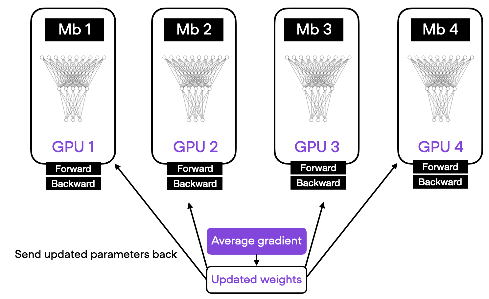
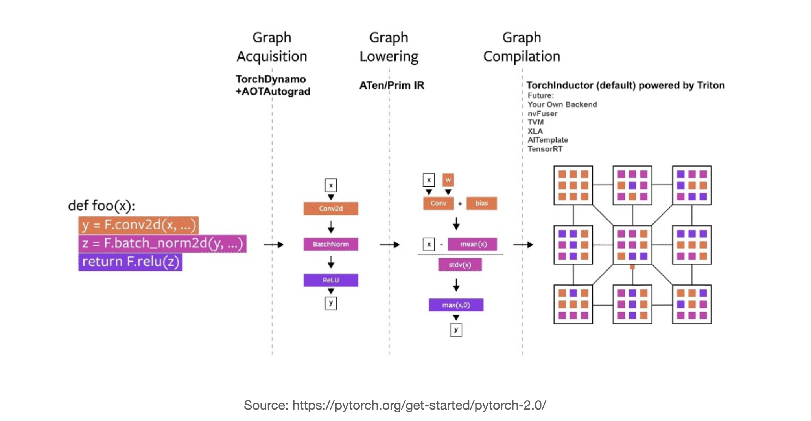

# Deep Learning Fundamentals Unit 9

## Techniques for Speeding Up Model Training

This unit covers various techniques to accelerate deep learning training.

**Mixed-precision training**

We cover mixed-precision training, a method that uses both 16-bit and 32-bit floating-point types to reduce memory usage and increase training speed, particularly on modern GPUs that have specialized hardware for 16-bit calculations.

**Multi-GPU training**

We also discuss several strategies for multi-GPU training, including data parallelism and model parallelism, where the former distributes different mini-batches of data across multiple GPUs and the latter splits a single model across several GPUs.

**Other performance tips**

Furthermore, we will discuss how to compile models using the new `torch.compile` feature in PyTorch 2.0, which can result in optimized models that give us additional speed-ups for both training and inference.

Also, we’ll discuss the relationship between batch size and training throughput, explaining how larger batch sizes can increase computational efficiency and thus speed up training, but also noting potential drawbacks like the risk of running out of memory and the potential for worse model performance due to fewer updates per epoch and a larger generalization gap.

This Studio provides a reproducible environment with the supplementary code for Unit 9 of the [**Deep Learning Fundamentals**](https://lightning.ai/pages/courses/deep-learning-fundamentals/) class by Sebastian Raschka, which is freely available at Lightning AI.

 

**What's included?**

Click the "Run Template" button at the top of this page to launch into a Studio environment that contains the following materials:

- `code-units/`:
  - `9.1-mixed-precision`: implementing a bag-of-words-based classifier as a baseline
  - `9.3-multi-gpu`:  finetuning a DistilBERT model on the movie review classification task
  - `9.4-compile`: compiling PyTorch models to accelerate training and inference
  - `9.5-batch-size-finder`: optimizing the batch size to improve throughput

- `exercises/`: 
  - `exercise-1-mixed-precision`: exercise 1,  evaluating mixed-precision performance
- `solutions/`: Solutions to the exercise above

---

 

<iframe width="560" height="315" src="https://www.youtube.com/embed/3SK_tFAcUP8?si=NGlrCWC7YsewAJAc" title="YouTube video player" frameborder="0" allow="accelerometer; autoplay; clipboard-write; encrypted-media; gyroscope; picture-in-picture; web-share" allowfullscreen></iframe>

- [Part 2](https://www.youtube.com/watch?v=eEKXC2Oti8A&list=PLaMu-SDt_RB403GN5DU7NYVoVmO5Vsgkh&index=5) continuing the video above
- [The complete YouTube Playlist](https://www.youtube.com/watch?v=uqYrVdlXkz8&list=PLaMu-SDt_RB403GN5DU7NYVoVmO5Vsgkh) with all 12 videos in Unit 9
- [Or access the Unit 9 videos on the Lightning website](https://lightning.ai/courses/deep-learning-fundamentals/), which includes additional quizzes

 

## About Unit 9: Speeding Up Model Training

**Mixed-Precision Training**

Unit 9.1 in this Studio begins with explaining mixed-precision training. Mixed-precision training in deep learning  involves using a combination of different numerical precisions (typically float32 and float16 or bfloat16) during model training to improve computational efficiency and speed.

Traditional training methods tend to use 32-bit floating-point numbers (float32) to represent weights, biases, activations, and gradients for neural networks. However, this can be computationally expensive and memory-intensive, particularly for large models and data sets. To address this, mixed-precision training employs lower-precision formats, namely 16-bit floating-point numbers (float16) and Brain Floating Point (bfloat16), in parts of the training process where higher precision is not critical.

The balance between speed, memory usage, and precision makes mixed-precision training an increasingly popular approach for training large-scale machine learning models.

**Multi-GPU Training**

Next, we covered training on multiple GPUs and the inherent benefits and strategies it offers for large-scale machine learning tasks. As a critical point, GPUs, which have a much higher number of cores compared to CPUs, are well-suited for parallel computations, making them ideal for training machine learning models.

We then discussed various categories of parallelism that harness the power of multiple GPUs: data parallelism, model parallelism, pipeline parallelism, tensor parallelism, and sequence parallelism.

For example, data parallelism involves distributing different subsets of the training data across multiple GPUs and then aggregating the gradients for the model update. Model parallelism splits the model itself across GPUs, where each GPU computes a part of the forward and backward pass. Tensor parallelism, on the other hand, is a more recent approach that splits the model’s tensors across multiple GPUs to handle extremely large models that don’t fit into a single GPU memory.

These techniques, in tandem or isolation, allow for the optimization of computational resources, speed up the training process, and enable the handling of larger models and datasets, thereby making multi-GPU training a key aspect of modern machine learning infrastructure.

**Compiling Models**

Un Unit 9.4, we covered torch.compile, which is a new feature introduced in PyTorch 2.0 that allows you to speed up your PyTorch code by JIT-compiling it into optimized kernels. Torch.compile is a fully additive feature, which means that it does not require you to make any changes to your existing code.

As we’ve seen, to use torch.compile, we can simply use the torch.compile() function for an exisiting PyTorch model without making any further modifications. The torch.compile function will then compile the model into an optimized kernel the first time it is called. Subsequent calls to the function or module will be much faster, as they will be executed directly on the GPU.

**Changing the Batch Size to Boost Throughput**

Lastly, we covered the topic of increasing batch sizes in Unit 9.5 to boost throughput in machine learning model training. The batch size, or the number of training samples processed before the model is updated, plays a critical role in the efficiency and effectiveness of model training. By increasing the batch size, we can process more data simultaneously, leading to higher computational efficiency and increased throughput, particularly on hardware like GPUs which excel in parallel processing.

However, in practice, throughput is not always everything, and we have to make sure to strike a careful balance between batch size, learning rate, computational resources, and the potential impact on model performance, which are all crucial considerations in machine learning training pipelines.

**Learn more by watching the videos of Deep Learning Fundamentals linked above and follow along with the code and exercises in this Studio. You can launch it by clicking the "Run Template" button at the top of this page to get started.**
