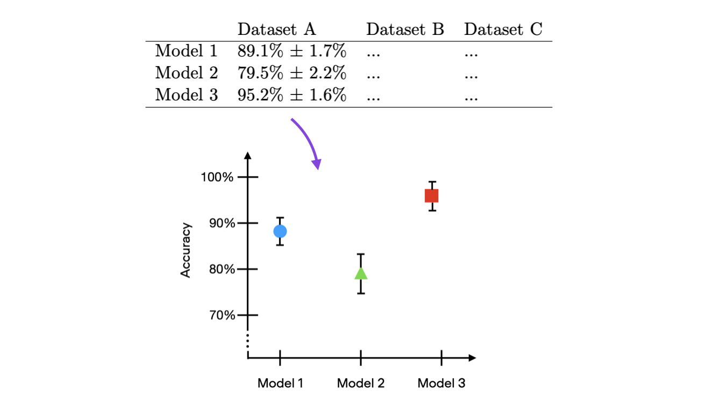
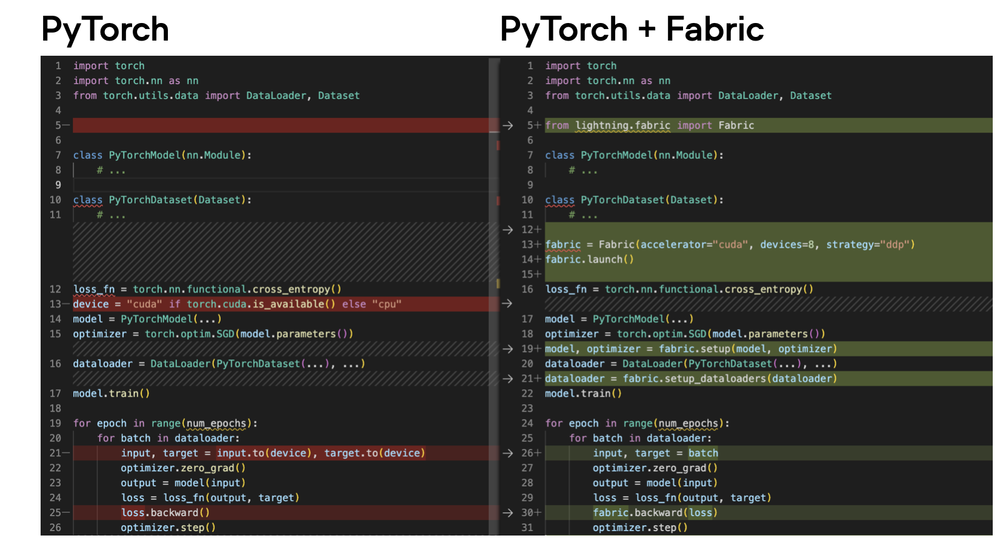

# Deep Learning Fundamentals Unit 10

## The Finale: Our Next Steps After AI Model Training

In this unit, we are concluding the course by discussing important considerations for training machine learning, deep learning, and AI models in practice. This includes touching upon the challenges concerning trustworthy and reliable prediction pipelines. Also, as the last coding examples for this course, we will be constructing confidence intervals for our machine learning models, and we will take a look at Fabric, which is an open-source library that allows users to boost PyTorch models via multi-GPU and mixed-precision training with only a few lines of code.

This Studio provides a reproducible environment with the supplementary code for Unit 10 of the [**Deep Learning Fundamentals**](https://lightning.ai/pages/courses/deep-learning-fundamentals/) class by Sebastian Raschka, which is freely available at Lightning AI.

 

**What's included?**

Click the "Run Template" button at the top of this page to launch into a Studio environment that contains the following materials:

- `code-units/`:
  - `10.1-confidence-intervals`: implementing confidence intervals for classifiers
  - `10.2-fabric`:  accelerating PyTorch with the Fabric open-source library

- `exercises/`: 
  - `exercise_1-ci`: exercise 1, coding and creating confidence intervals for an image classifier
  - `exercise_2-fabric`: exercise 2,  accelerating an image classifier using Fabric
- `solutions/`: Solutions to the exercise above

---

 

<iframe width="560" height="315" src="https://www.youtube.com/embed/eqf6-WGpgx8?si=tzvPNGuYsQFPXuV1" title="YouTube video player" frameborder="0" allow="accelerometer; autoplay; clipboard-write; encrypted-media; gyroscope; picture-in-picture; web-share" allowfullscreen></iframe>

- [The complete YouTube Playlist](https://www.youtube.com/watch?v=eqf6-WGpgx8&list=PLaMu-SDt_RB7SFGD5Xr2OxZQseIPEk3b1) with all 7 videos in Unit 10
- [Or access the Unit 10 videos on the Lightning website](https://lightning.ai/courses/deep-learning-fundamentals/), which includes additional quizzes

 

## About Unit 10

In this lecture we discuss the fundamental principles for creating trustworthy and reliable machine learning systems. Firstly, there’s the importance of privacy in machine learning applications: consent must be obtained before data collection and sharing models trained on sensitive data should be avoided. Then, there’s the necessity for fairness and ethics in designing machine learning systems, to prevent potential harm or injustices. Also, it’s worth highlighting the significance of transparency and interpretability: details like dataset limitations and known bugs should be documented and shared.

Quantifying uncertainty in machine learning predictions is one of the many aspects behind designing trustworthy systems. There are two main methods to quantify this uncertainty: confidence intervals and conformal predictions. Confidence intervals provide a range of values which contains the true value with a certain level of confidence, and are often used to estimate model accuracy. Conformal predictions, on the other hand, are concerned with the uncertainty of individual predictions themselves, and provide a set of labels that contain the correct label with a given confidence level.

In the Unit 10.1 code examples, we implement confidence intervals for a finetuned LLM in PyTorch.

Figure: An example of how confidence intervals can be displayed for the accuracy estimates of three different deep neural network classification models

Then, in Unit 10.2 contained in this Studio, you will learn about [Fabric](https://lightning.ai/docs/fabric/stable/), an open-source library designed for scaling PyTorch models without requiring a significant rewriting of code.

Fabric integrates with PyTorch, allowing the implementation of features such as mixed precision training and multi-GPU training, typically found in the Lightning Trainer, without the need to restructure our code around a Lightning Module, which can be useful if we adopt or port existing PyTorch code.

Figure: An overview of the minimal code changes required when integrating Fabric

**Learn more by watching the videos of Deep Learning Fundamentals linked above and follow along with the code and exercises in this Studio. You can launch it by clicking the "Run Template" button at the top of this page to get started.**
